  
  
```{r setup, include=FALSE}
knitr::opts_chunk$set(echo = FALSE, warning = FALSE, message = FALSE, out.height = '70%', out.width = '70%', fig.align = "center", comment = "#>")
```


```{r}
library(ggplot2)
library(dplyr)
library(cluster)
library(reshape2)
library(Rcpp)
library(grid)
library(gridExtra)
library(clustMixType)
library(tidyr)
library(png)
```
# 1. Introduction

The dataset provides insights into user behavior on an online shopping site. It features various types of data, including continuous, binary, and categorical variables. These variables encompass the count of administrative actions (`Administrative`), interactions related to products (`ProductRelated`), and binary markers indicating whether a visit took place on a weekend (`Weekend`) or led to a purchase (`Revenue`). Furthermore, it includes categorical information such as the user's browser (`Browser`), location (`Region`), and type of visitor (`VisitorType`).

## Goals of the analysis

The primary objective of this analysis is to explore the dataset using **Gower distance** and **Multidimensional scaling (MDS)** for efficient mixed-type data analysis. By applying different distance metrics and visualizing the relationships between observations, this study aims to identify patterns, clusters and the influence of specific variables on the data structure. The analysis focuses on understanding user behaviour and clustering patterns in a reduced-dimensional space, while ensuring robustness and reliability of the results.

## Importance of Distance Metrics

Distance metrics are essential in data science, particularly for clustering and classification. They assess how similar or different data points are and significantly affect the quality of outcomes. Choosing the right metric is crucial for achieving precise and valuable analyses, especially with mixed-type data.

```{r, include=FALSE}
# Import data
data <- readRDS('data/R_datasets/processed_dataset.rds')

# Data wrangling
data <- data %>% 
  mutate(
    Weekend = as.numeric(as.character(Weekend)),
    Revenue = as.numeric(as.character(Revenue)),
    SpecialDay = as.numeric(SpecialDay),
    VisitorType = as.numeric(VisitorType),
    Month = as.numeric(Month),
    OperatingSystems = as.numeric(as.character(OperatingSystems)),
    Browser = as.numeric(as.character(Browser)),
    Region = as.numeric(as.character(Region)),
    TrafficType = as.numeric(as.character(TrafficType))
  ) %>%
  .[, c(
    "Administrative", "AdministrativeDuration", "Informational", "InformationalDuration", 
    "ProductRelated", "ProductRelatedDuration", "BounceRates", "ExitRates", "PageValues", 
    "Weekend", "Revenue", "SpecialDay", "Month", "OperatingSystems", "Browser", "Region", 
    "TrafficType", "VisitorType"
  )] %>%
  sample_n(1000)  # Randomly sample 1000 observations

# Data without revenue variable
data_no_revenue <- data %>% select(-Revenue)

str(data)
```

```{r}
continuous_data = data[, c(
  "Administrative", "AdministrativeDuration", "Informational", "InformationalDuration", 
  "ProductRelated", "ProductRelatedDuration", "BounceRates", "ExitRates", "PageValues"
)]
binary_data = data[, c("Weekend", "Revenue")]
categorical_data = data[, c("SpecialDay", "Month", "OperatingSystems", "Browser", "Region", "TrafficType", "VisitorType")]
```

# 2. Definition of Distance Metrics

## What Are Distance Metrics?
Distance metrics are mathematical tools that measure how similar or different two data points are within a dataset. They play an important role in clustering, classification, and reducing dimensions, as they define the "closeness" or "separation" of two observations in a feature space.

## Why Are Distance Metrics Important?
Distance metrics are essential to numerous machine learning algorithms, as they influence how data points are categorized or clustered. Selecting the appropriate metric is crucial for achieving accurate and significant outcomes, especially when dealing with different types of data.

# 3. Distance Metrics for Different Data Types

---

## Continuous Data
For continuous variables, the following metrics are commonly used:

- **Euclidean Distance**:
  - the simplest measure, determining the direct distance between two points in a multi-dimensional environment.
  - Formula:
    \[
    d(x, y) = \sqrt{\sum_{i=1}^n (x_i - y_i)^2}
    \]
  - **Use Case:** Works well for normalized continuous data.
  
  - **Manhattan Distance**:
    - Calculates the total of the absolute differences between matching features.
    - Formula:
    \[
    d(x, y) = \sum_{i=1}^n |x_i - y_i|
    \]
  - **Use Case:** Appropriate for data with lower dimensions or when linear variations are more significant.
  
  - **Canberra Distance**:
  - Places greater emphasis on minor differences, particularly for values that are low in sizes.
  - Formula:
    \[
    d(x, y) = \sum_{i=1}^n \frac{|x_i - y_i|}{|x_i| + |y_i|}
    \]
  - **Use Case:** Ideal for datasets with variables of small sizes.

- **Mahalanobis Distance**:
  - Considers the relationships between variables and adjusts distances based on variance.
  - Formula:
    \[
    d(x, y) = \sqrt{(x - y)^T S^{-1} (x - y)}
    \]
    Where \(S\) is the covariance matrix.
  - **Use Case:** Ideal for related continuous variables that have different scales.

```{r, cache = TRUE}
# Euclidean distance
d_euclidean <- as.matrix(dist(continuous_data, method = "euclidean"))

# Manhattan distance
d_manhattan <- as.matrix(dist(continuous_data, method = "manhattan"))

# Canberra distance
d_canberra <- as.matrix(dist(continuous_data, method = "canberra"))

# Mahalanobis distance
d_mahalanobis_matrix <- as.matrix(dist(as.matrix(continuous_data), diag = TRUE, upper = TRUE))
```

```{r, cache = TRUE}
# Plot the distance matrices in heatmaps using ggplot
p1 <- ggplot(melt(d_euclidean[1:500,1:500]), aes(Var1, Var2, fill = value)) +
  geom_tile() +
  scale_fill_gradient(low = "white", high = "blue") +
  theme_minimal() +
  labs(title = "Euclidean distance") +
  theme(legend.position = "none") + 
  coord_fixed()


p2 <- ggplot(melt(d_manhattan[1:500,1:500]), aes(Var1, Var2, fill = value)) +
  geom_tile() +
  scale_fill_gradient(low = "white", high = "blue") +
  theme_minimal() +
  labs(title = "Manhattan distance") +
  theme(legend.position = "none") + 
  coord_fixed()

p3 <- ggplot(melt(d_canberra[1:500,1:500]), aes(Var1, Var2, fill = value)) +
  geom_tile() +
  scale_fill_gradient(low = "white", high = "blue") +
  theme_minimal() +
  labs(title = "Canberra distance") +
  theme(legend.position = "none") + 
  coord_fixed()


p4 <- ggplot(melt(d_mahalanobis_matrix[1:500,1:500]), aes(Var1, Var2, fill = value)) +
  geom_tile() +
  scale_fill_gradient(low = "white", high = "blue") +
  theme_minimal() +
  labs(title = "Mahalanobis distance") +
  theme(legend.position = "none") + 
  coord_fixed()

```

```{r, cache = TRUE}
# Set up a 2x2 layout for the plots
grid.arrange(p1, p2, p3, p4, ncol = 2)
```
---

## Binary Data
For binary variables, the following measurements are commonly utilized:

- **Jaccard Distance**:
  - Focuses on mismatches while ignoring shared absences.
  - Formula:
    \[
    d(x, y) = 1 - \frac{a}{a + b + c}
    \]
  - **Use Case:** Appropriate for sparse binary datasets.

- **Sokal-Michener Distance**:
  - Takes into account both matches and mismatches.
  - Formula:
    \[
    d(x, y) = 1 - \frac{a + d}{p}
    \]
    
  - **Use Case:** Ideal for datasets where matches are as important as mismatches.


```{r}
# Jaccard distance
d_jaccard <- as.matrix(dist(binary_data, method = "binary"))

# Sokal-Michener distance
sokal_michener <- function(data) {
  n <- nrow(data)
  dist_matrix <- matrix(0, n, n)  # Initialize distance matrix
  
  for (i in 1:n) {
    for (j in i:n) {
      # Compare the two rows
      matches <- sum(data[i, ] == data[j, ])
      total <- ncol(data)
      distance <- 1 - (matches / total)
      
      # Fill the symmetric matrix
      dist_matrix[i, j] <- distance
      dist_matrix[j, i] <- distance
    }
  }
  
  return(dist_matrix)  # Return as a distance object
}

d_sokal_michener <- sokal_michener(as.matrix(binary_data))
```


```{r, cache = TRUE}
# Plot the distance matrices in heatmaps using ggplot
p1 = ggplot(melt(d_jaccard[1:500,1:500]), aes(Var1, Var2, fill = value)) +
  geom_tile() +
  scale_fill_gradient(low = "white", high = "blue") +
  theme_minimal() +
  labs(title = "Jaccard distance") + 
  coord_fixed()


p2 = ggplot(melt(d_sokal_michener[1:500,1:500]), aes(Var1, Var2, fill = value)) +
  geom_tile() +
  scale_fill_gradient(low = "white", high = "blue") +
  theme_minimal() +
  labs(title = "Sokal-Michener distance") + 
  coord_fixed()


# Set up a 1x2 layout for the plots
grid.arrange(p1, p2, ncol = 2)

```
---

## Categorical Data
For categorical variables, the following metrics are effective:

- **Matching Coefficients**:
  - Measure the similarity between categorical variables by counting exact matches.
  - Formula:
    \[
    d(x, y) = \frac{\text{Number of Matches}}{\text{Total Observations}}
    \]
  - **Use Case:** Suitable for datasets where similarity in categories matters.

- **Dissimilarity Coefficients**:
  - Focus on differences between categories.
  - Formula:
    \[
    d(x, y) = \frac{\text{Number of Mismatches}}{\text{Total Observations}}
    \]
  - **Use Case:** Useful when the focus is on categorical diversity.


```{r}
# Dissimilarity coeffients (matching coefficients)
matching_coefficients <- function(data) {
  n <- nrow(data)
  dist_matrix <- matrix(0, n, n)  # Initialize distance matrix
  
  for (i in 1:n) {
    for (j in i:n) {
      # Compare the two rows
      matches <- sum(data[i, ] == data[j, ])
      total <- ncol(data)
      dissim_coef <- 1 - (matches / total)
      
      # Fill the symmetric matrix
      dist_matrix[i, j] <- dissim_coef
      dist_matrix[j, i] <- dissim_coef
    }
  }
  
  return(dist_matrix)  # Return as a distance object
}

# Other disssimilarity coefficients for categorical data
dissim_coefficients_6 <- function(data) {
  n <- nrow(data)
  dist_matrix <- matrix(0, n, n)  # Initialize distance matrix
  
  for (i in 1:n) {
    for (j in i:n) {
      # Compare the two rows
      matches <- sum(data[i, ] == data[j, ])
      total <- ncol(data)
      distance <- 1 - (matches / (matches + 2*(total - matches)))
      
      # Fill the symmetric matrix
      dist_matrix[i, j] <- distance
      dist_matrix[j, i] <- distance
    }
  }
  
  return(dist_matrix)  # Return as a distance object

}
```


```{r}
d_matching_coefficients <- matching_coefficients(as.matrix(categorical_data))
d_matching_coefficients_6 <- dissim_coefficients_6(as.matrix(categorical_data))
```

```{r}
# Plot the distance matrices in heatmaps using ggplot
p1 = ggplot(melt(d_matching_coefficients[1:500,1:500]), aes(Var1, Var2, fill = value)) +
  geom_tile() +
  scale_fill_gradient(low = "white", high = "blue") +
  theme_minimal() +
  labs(title = "Matching coefficients") + 
  coord_fixed()

p2 = ggplot(melt(d_matching_coefficients_6[1:500,1:500]), aes(Var1, Var2, fill = value)) +
  geom_tile() +
  scale_fill_gradient(low = "white", high = "blue") +
  theme_minimal() +
  labs(title = "Dissimilarity coefficient") + 
  coord_fixed()
```

```{r}
grid.arrange(p1, p2, ncol = 2)
```
---

## Mixed Data
For datasets with mixed variable types (continuous, binary, and categorical), a flexible metric is required:

- **Gower Distance**:
  - Combines different metrics depending on the data type of each feature.
  - Formula:
    \[
    d(x, y) =  1 - \frac{\sum_{h=1}^{p} s_h(x_h, y_h)}{p}
    \]
    Where s_h(x_h, y_h) is a similarity score for each variable h.
  - **Use Case:** Ideal for datasets with mixed data types.
  
  
```{r}
# Convert binary variables to factor
binary_data <- lapply(binary_data, as.factor)

# Combine the continuous, binary, and categorical data into a single dataset
mixed_data <- data.frame(continuous_data, binary_data, categorical_data)

# Compute Gower Distance using daisy()
d_gower_daisy <- daisy(mixed_data, metric = "gower")

# Convert Gower Distance matrix to long format for ggplot2
melted_gower <- melt(as.matrix(d_gower_daisy))

# Plot the heatmap
p_gower <- ggplot(melted_gower, aes(Var1, Var2, fill = value)) +
  geom_tile() +
  scale_fill_gradient(low = "white", high = "blue") +
  theme_minimal() +
  labs(title = "Gower Distance Heatmap") +
  coord_fixed()

# Display the plot
print(p_gower)

```
---

# 4. Comparison of Distance Metrics

## Final Remarks
Analyzing different distance metrics gave important information about how the observations in the dataset are related. Each metric has its own strengths suited for certain types of data.

- **Continuous Data**: Looking at different distance metrics like Euclidean, Manhattan, Canberra, and Mahalanobis provided various views, showing how scale and correlations matter.
- **Binary Data**: Jaccard and Sokal-Michener metrics highlighted the importance of presence/absence and balanced matches, respectively.
- **Categorical Data**: Matching and dissimilarity coefficients showed different but helpful views on how categories are similar and different.
- **Mixed Data**: The Gower Distance proved to be the best metric, integrating input from continuous, binary, and categorical variables into one clear measure.

Although individual metrics gave more insight into specific data types, the Gower Distance was chosen for the final Multidimensional Scaling (MDS) analysis. This decision guarantees that all types of variables are accurately represented, reflecting the mixed nature of the dataset and providing a complete view of the underlying patterns.

# 5. Multidimensional Scaling (MDS)

## Use of Distance Matrices in MDS

Multidimensional Scaling (MDS) is a technique that reduces dimensions by using distance matrices to show high-dimensional data in a simpler form. Its aim is to keep the distances between pairs of observations as close as possible in the new space.

The steps are: 

- 1. Create a distance matrix (\(D\)) for all observation pairs using a selected distance method (Gower). 

- 2. Adjust the points in the lower-dimensional space so that the distances between them reflect the original distance matrix.

MDS is particularly useful for visualizing patterns, clusters, and relationships in high-dimensional data.


## Multidimensional Scaling (MDS) Using Gower's Distance

### Objective

Reduce the dimensions of a mixed-type dataset with MDS and Gower's distance.

### Results and Insights

### 1. Cumulative Variance Explained
- The cumulative variance plot (Figure 1) indicates that the first two dimensions account for 18.54% of the overall variability. 
- This suggests that more dimensions are necessary to fully understand the data's structure.

### 2. MDS Configuration
- The scatterplot (Figure 2) shows the first two dimensions (PC1 and PC2).
- Clusters and groups suggest that some observations share similar traits.
- The MDS setup reveals patterns in the data that match its mixed characteristics.

#### Figures

| 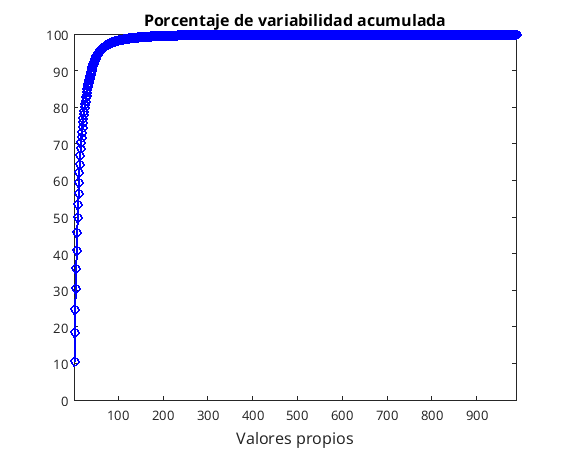{ width=300px } | 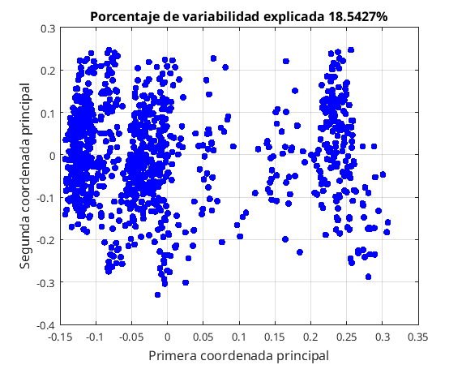{ width=300px } |
  |:-----------------------------------------------------------------------------------:|:--------------------------------------------------------------------:|
  | **Figure: Cumulative Variance Explained**                                        | **Figure: MDS Configuration**                                    |
  
  
## Influence of the Original Variables in the MDS Maps

The influence of the original variables on the MDS configuration is analyzed by computing the **cross-correlations/associations** between the original dataset variables and the first three principal coordinates. 

### Heatmap Interpretation
The heatmap (Figure 3) visualizes the correlations of each original variable with the first three principal coordinates (PC1, PC2, and PC3). 

The heatmap highlights the importance of both quantitative and categorical variables in shaping the structure of the MDS maps. Gower’s distance proves particularly effective in this context as it allows for the integration of mixed data types, treating continuous, binary, and categorical variables appropriately. Quantitative variables, such as BounceRates and ProductRelatedDuration, exhibit strong correlations with the first and second principal coordinates (PC1 and PC2), indicating their substantial contribution to the observed variability in the dataset. At the same time, categorical variables like VisitorType, Browser, and SpecialDay show notable associations with PC2 and PC3, demonstrating their relevance in capturing additional patterns or groupings that quantitative variables alone may not reveal.

Gower’s distance achieves this balance by scaling continuous variables to account for differences in range while simultaneously evaluating the similarities or mismatches for categorical and binary data. As a result, no single type of variable dominates the MDS configuration, ensuring that the mixed nature of the dataset is preserved and effectively represented in the reduced dimensions. The heatmap’s color gradients further emphasize this balance, with strong positive or negative correlations distributed across both quantitative and categorical variables, highlighting their combined influence on the MDS structure.

---

#### Figure: Principal Coordinates Heatmap
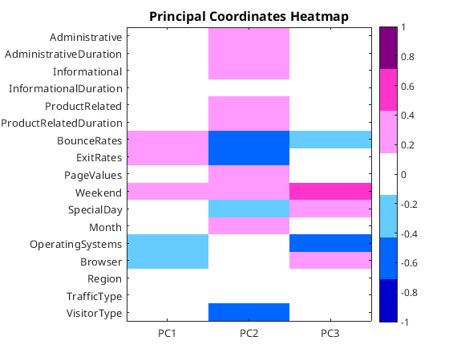{ width=300px }


## Variable Partial Influence on the Principal Coordinates

The study of the influence of the original variables on the MDS map was performed using Gower's interpolation formula. This method, allows us to assess how much each variable influences the principal components. The results for qualitative and quantitative variables are presented separately.

### Influence of Qualitative Variables

The analysis of the qualitative variables is shown in Figure 4. It can be observed that the first principal component (PC1) is mainly influenced by the variables VisitorType and Weekend. VisitorType separates observations by visitor type (e.g., returning or new), which appears to drive significant variation in the PC1 axis. In addition, the Weekend variable also contributes to the variation in observations, which is expected in data related to user behavior.

The second principal component (PC2) is most influenced by the OperatingSystems and Browser variables. These variables specify technical details, such as the operating system or browser used by users. Their contribution to the second axis shows that technical preferences play a secondary but important role in differentiating observations.


### Influence of Quantitative Variables

The influence of the quantitative variables is shown in Figure 5. Administrative and ProductRelated variables are the ones that dominate the first principal component (PC1). Their contribution suggests that the frequency of user interaction with administrative and product pages plays a key role in explaining the overall variation in the data.

In the second principal component (PC2), the BounceRates and PageValues variables show the greatest influence. The value of BounceRates, which represents the percentage of users who leave the site quickly, and PageValues, which is related to the value of pages visited, suggest user behaviors that influence the variance along the second axis.

#### Figures

| 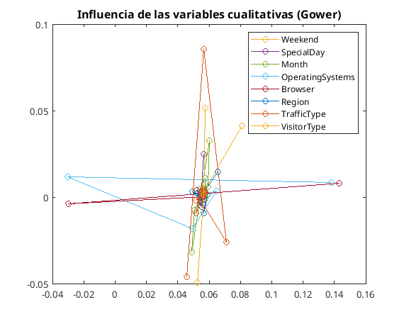{ width=300px } | 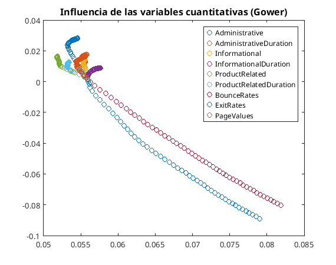{ width=300px } |
  |:-----------------------------------------------------------------------------------:|:--------------------------------------------------------------------:|
  | **Figure: Influence of Qualitative Variables (Gower)**                                        | **Figure: Influence of Quantitative Variables (Gower)**                                    |
  
  
## Conditional Scatterplots for PC1 and PC2

The results of the scatterplots show that the BounceRates and ExitRates variables show a strong correlation with both principal components (PC1 and PC2), revealing their importance in shaping the overall pattern. Similarly, the VisitorType variable is mainly associated with the second component (PC2), while categorical variables such as Browser and OperatingSystems show clear separations along the first component (PC1). These findings suggest that different user types form distinct groups or behaviors that are clearly reflected in the reduced dimensional space.

With respect to user behavior, it is observed that the highest values of BounceRates and ExitRates are mainly concentrated at the bottom of the second component (PC2), indicating users who quickly leave the site. On the other hand, the categorical variables Browser and OperatingSystems create distinct clusters along PC1, which may be related to different categories of technologies used by users (e.g., different browsers or operating systems). Finally, the Weekend variable shows little variation in the distribution of users over the weekend, potentially revealing lower traffic or changes in behavior on specific days.

\newpage

### Figures

| 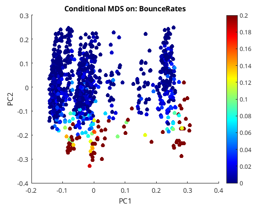{ width=250px } | 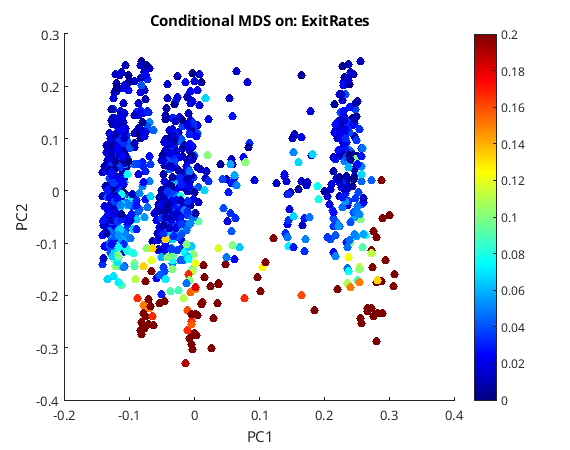{ width=250px } |
|:----------------------------------------------------------------------------------:|:----------------------------------------------------------------------------:|
| **Figure: Conditional MDS on BounceRates**                                       | **Figure: Conditional MDS on ExitRates**                                    |

| 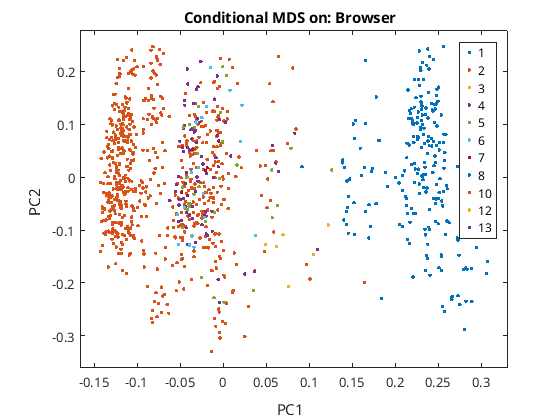{ width=250px }         | 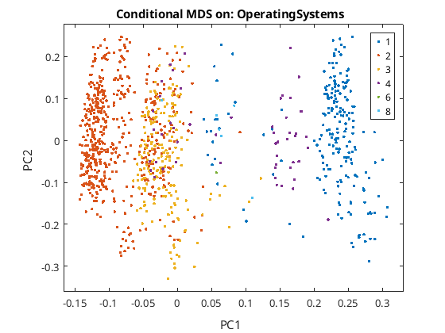{ width=250px } |
|:----------------------------------------------------------------------------------:|:----------------------------------------------------------------------------:|
| **Figure: Conditional MDS on Browser**                                           | **Figure: Conditional MDS on OperatingSystems**                             |

| 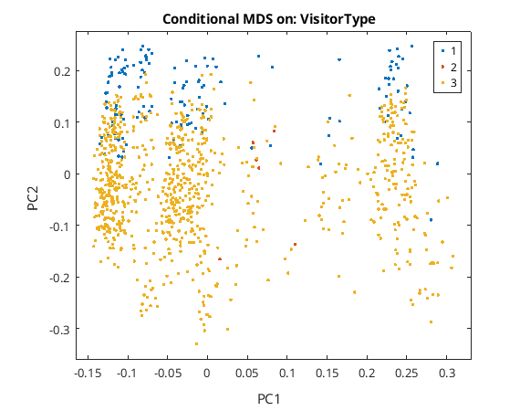{ width=250px } | { width=250px } |
|:-------------------------------------------------------------------------------------:|:--------------------------------------------------------------------------:|
|**Figure: Conditional MDS on VisitorType**                                          | **Figure: Conditional MDS on Weekend**                                   |


## Sensitivity of the MDS Configuration

In the graph below, the scatter of points shows the variability of their positions in the MDS array. The majority of the points show small deviations, suggesting that the overall structure of the MDS remains stable. This confirms that the observed patterns and clusters formed in the array are reliable and are not affected by minor modifications or noise in the data.

However, areas of greater variability are observed, as indicated by more scattered spots with larger rings. These areas may be associated with outliers or data with higher uncertainty, which affect the MDS array to a greater extent. The existence of this variability may indicate the need for further analysis or normalisation of the data.

Overall, the sensitivity analysis confirms that the MDS layout is stable and the relationships between observations are consistently captured. The overall structure of the data is maintained, providing reliable and interpretable information about the patterns and clusters present in the data set.

### Figure
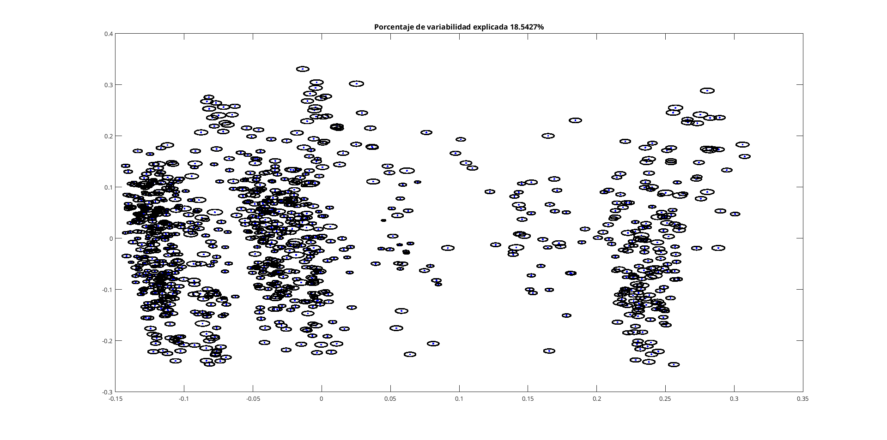{ width=600px }