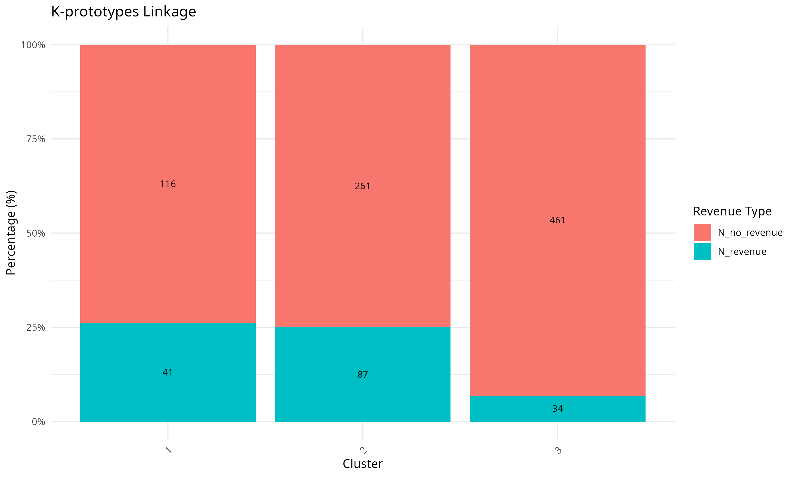

```{r setup, include=FALSE}
knitr::opts_chunk$set(echo = FALSE, warning = FALSE, message = FALSE, out.height = '70%', out.width = '70%', fig.align = "center", comment = "#>")
```


```{r}
library(ggplot2)
library(dplyr)
library(cluster)
library(reshape2)
library(Rcpp)
library(grid)
library(gridExtra)
library(clustMixType)
library(tidyr)
library(png)
```


```{r, include=FALSE}
# Import data
data <- readRDS('data/R_datasets/processed_dataset.rds')

# Data wrangling
data <- data %>% 
  mutate(
    Weekend = as.numeric(as.character(Weekend)),
    Revenue = as.numeric(as.character(Revenue)),
    SpecialDay = as.numeric(SpecialDay),
    VisitorType = as.numeric(VisitorType),
    Month = as.numeric(Month),
    OperatingSystems = as.numeric(as.character(OperatingSystems)),
    Browser = as.numeric(as.character(Browser)),
    Region = as.numeric(as.character(Region)),
    TrafficType = as.numeric(as.character(TrafficType))
  ) %>%
  .[, c(
    "Administrative", "AdministrativeDuration", "Informational", "InformationalDuration", 
    "ProductRelated", "ProductRelatedDuration", "BounceRates", "ExitRates", "PageValues", 
    "Weekend", "Revenue", "SpecialDay", "Month", "OperatingSystems", "Browser", "Region", 
    "TrafficType", "VisitorType"
  )] %>%
  sample_n(1000)  # Randomly sample 1000 observations

# Data without revenue variable
data_no_revenue <- data %>% select(-Revenue)

str(data)
```

```{r}
continuous_data = data[, c(
  "Administrative", "AdministrativeDuration", "Informational", "InformationalDuration", 
  "ProductRelated", "ProductRelatedDuration", "BounceRates", "ExitRates", "PageValues"
)]
binary_data = data[, c("Weekend", "Revenue")]
categorical_data = data[, c("SpecialDay", "Month", "OperatingSystems", "Browser", "Region", "TrafficType", "VisitorType")]
```

# Multidimenional Scaling

Multidimensional Scaling (MDS) is a powerful technique used to visualize complex data by arranging points in a low-dimensional Euclidean space. Unlike Principal Component Analysis (PCA), which works on raw data, MDS operates on a **distance matrix**, making it suitable for various types of data, including binary, categorical, and quantitative.

The goal of MDS is to find a configuration of points in a lower-dimensional space that best preserves the pairwise distances from the original distance matrix. This allows us to visually explore the relationships between observations in a way that is easier to interpret.

### **Advantages of MDS:**
- Works with any type of data as long as a distance measure can be computed.
- Provides a clear visual representation of complex relationships in the data.

### **Challenges:**
- Interpreting the principal coordinates can be more difficult than in PCA.
- MDS can be computationally expensive for large datasets.

MDS is particularly useful when we only have distance information and want to understand the structure of the data without needing to rely on raw feature values. In this section, we will apply MDS to our dataset to uncover its underlying patterns.

## Distance Metrics

When applying Multidimensional Scaling (MDS), selecting the appropriate distance metric is crucial because it directly impacts the MDS configuration and how relationships between data points are interpreted.

Different distance metrics capture different aspects of similarity or dissimilarity, which leads to varying representations of the data in the low-dimensional space. An inappropriate distance metric can distort these relationships, resulting in misleading conclusions.

For example, using **Euclidean distance** on a dataset with both quantitative and qualitative variables may not reflect the true dissimilarities, as it assumes continuous and scale-invariant data. In such cases, a metric like **Gower’s distance**, which can handle mixed data types, would be more appropriate.

### Why the Right Distance Metric Matters:
- **Data Type Compatibility:**
  - **Euclidean distance** is ideal for continuous, quantitative data.
  - **Matching coefficients** are used for binary data.
  - **Gower’s distance** is versatile, handling quantitative, binary, and categorical data.

- **Scale Invariance:**
  - **Euclidean distance** is **not scale-invariant**, meaning larger-scaled variables influence the distance more.
  - **Mahalanobis distance** is **scale-invariant**, adjusting for variance and correlations between variables.


### Comparison of Distance Metrics

#### Continuous Data
```{r, cache = TRUE}
# Euclidean distance
d_euclidean <- as.matrix(dist(continuous_data, method = "euclidean"))

# Manhattan distance
d_manhattan <- as.matrix(dist(continuous_data, method = "manhattan"))

# Canberra distance
d_canberra <- as.matrix(dist(continuous_data, method = "canberra"))

# Mahalanobis distance
sourceCpp("scripts/mahalanobis_dist.cpp")
D <- maha(as.matrix(continuous_data))
```

```{r, cache = TRUE}
# Plot the distance matrices in heatmaps using ggplot
p1 <- ggplot(melt(d_euclidean[1:500,1:500]), aes(Var1, Var2, fill = value)) +
  geom_tile() +
  scale_fill_gradient(low = "white", high = "blue") +
  theme_minimal() +
  labs(title = "Euclidean distance") +
  theme(legend.position = "none") + 
  coord_fixed()


p2 <- ggplot(melt(d_manhattan[1:500,1:500]), aes(Var1, Var2, fill = value)) +
  geom_tile() +
  scale_fill_gradient(low = "white", high = "blue") +
  theme_minimal() +
  labs(title = "Manhattan distance") +
  theme(legend.position = "none") + 
  coord_fixed()

p3 <- ggplot(melt(d_canberra[1:500,1:500]), aes(Var1, Var2, fill = value)) +
  geom_tile() +
  scale_fill_gradient(low = "white", high = "blue") +
  theme_minimal() +
  labs(title = "Canberra distance") +
  theme(legend.position = "none") + 
  coord_fixed()


p4 <- ggplot(melt(D[1:500,1:500]), aes(Var1, Var2, fill = value)) +
  geom_tile() +
  scale_fill_gradient(low = "white", high = "blue") +
  theme_minimal() +
  labs(title = "Mahalanobis distance") +
  theme(legend.position = "none") + 
  coord_fixed()

```

```{r, cache = TRUE}
# Set up a 2x2 layout for the plots
grid.arrange(p1, p2, p3, p4, ncol = 2)
```

#### Binary Data

```{r}
# Jaccard distance
d_jaccard <- as.matrix(dist(binary_data, method = "binary"))

# Sokal-Michener distance
sokal_michener <- function(data) {
  n <- nrow(data)
  dist_matrix <- matrix(0, n, n)  # Initialize distance matrix
  
  for (i in 1:n) {
    for (j in i:n) {
      # Compare the two rows
      matches <- sum(data[i, ] == data[j, ])
      total <- ncol(data)
      distance <- 1 - (matches / total)
      
      # Fill the symmetric matrix
      dist_matrix[i, j] <- distance
      dist_matrix[j, i] <- distance
    }
  }
  
  return(dist_matrix)  # Return as a distance object
}

d_sokal_michener <- sokal_michener(as.matrix(binary_data))
```


```{r, cache = TRUE}
# Plot the distance matrices in heatmaps using ggplot
p1 = ggplot(melt(d_jaccard[1:500,1:500]), aes(Var1, Var2, fill = value)) +
  geom_tile() +
  scale_fill_gradient(low = "white", high = "blue") +
  theme_minimal() +
  labs(title = "Jaccard distance") + 
  coord_fixed()


p2 = ggplot(melt(d_sokal_michener[1:500,1:500]), aes(Var1, Var2, fill = value)) +
  geom_tile() +
  scale_fill_gradient(low = "white", high = "blue") +
  theme_minimal() +
  labs(title = "Sokal-Michener distance") + 
  coord_fixed()


# Set up a 1x2 layout for the plots
grid.arrange(p1, p2, ncol = 2)

```


#### Categorical Data


```{r}
# Dissimilarity coeffients (matching coefficients)
matching_coefficients <- function(data) {
  n <- nrow(data)
  dist_matrix <- matrix(0, n, n)  # Initialize distance matrix
  
  for (i in 1:n) {
    for (j in i:n) {
      # Compare the two rows
      matches <- sum(data[i, ] == data[j, ])
      total <- ncol(data)
      dissim_coef <- 1 - (matches / total)
      
      # Fill the symmetric matrix
      dist_matrix[i, j] <- dissim_coef
      dist_matrix[j, i] <- dissim_coef
    }
  }
  
  return(dist_matrix)  # Return as a distance object
}

# Other disssimilarity coefficients for categorical data
dissim_coefficients_6 <- function(data) {
  n <- nrow(data)
  dist_matrix <- matrix(0, n, n)  # Initialize distance matrix
  
  for (i in 1:n) {
    for (j in i:n) {
      # Compare the two rows
      matches <- sum(data[i, ] == data[j, ])
      total <- ncol(data)
      distance <- 1 - (matches / (matches + 2*(total - matches)))
      
      # Fill the symmetric matrix
      dist_matrix[i, j] <- distance
      dist_matrix[j, i] <- distance
    }
  }
  
  return(dist_matrix)  # Return as a distance object

}
```

```{r}
d_matching_coefficients <- matching_coefficients(as.matrix(categorical_data))
d_matching_coefficients_6 <- dissim_coefficients_6(as.matrix(categorical_data))
```

```{r}
# Plot the distance matrices in heatmaps using ggplot
p1 = ggplot(melt(d_matching_coefficients[1:500,1:500]), aes(Var1, Var2, fill = value)) +
  geom_tile() +
  scale_fill_gradient(low = "white", high = "blue") +
  theme_minimal() +
  labs(title = "Matching coefficients") + 
  coord_fixed()

p2 = ggplot(melt(d_matching_coefficients_6[1:500,1:500]), aes(Var1, Var2, fill = value)) +
  geom_tile() +
  scale_fill_gradient(low = "white", high = "blue") +
  theme_minimal() +
  labs(title = "Dissimilarity coefficient") + 
  coord_fixed()
```

```{r}
grid.arrange(p1, p2, ncol = 2)
```


# Cluster analysis

Clustering is an unsupervised learning technique used to group data based on similarities. It does not require prior knowledge of the number of groups and is useful for discovering patterns, understanding relationships, and summarizing data. In this section, we will apply several clustering methods, including hierarchical and non hierarchical clustering, to identify meaningful clusters in the dataset.

- **Hierarchical Clustering:**  
  This method builds a hierarchy of clusters, either by starting with individual data points and merging them (agglomerative) or by starting with one large group and splitting it (divisive). Different linkage criteria (single, complete, and average) were used to calculate the distance between clusters, with results shown in dendrograms.

- **K-Medoids Clustering:**  
  K-medoids is similar to k-means, but it uses actual data points as the center of each cluster, making it more flexible with different distance measures. The PAM (Partitioning Around Medoids) algorithm was used to find the best clusters.
  
- **K-Prototypes Clustering:**
  K-prototypes is an extension of k-means that can handle mixed data types (categorical and numerical). It combines k-means for numerical data and k-modes for categorical data to find the best clusters.

The selection of this clustering methods was based on the data types present in the dataset. Since the dataset contains a mix of continuous, binary, and categorical variables, we chose clustering methods that can handle these different data types effectively. K-means, for example, is not suitable for categorical data, so we opted for K-prototypes instead.

## Hierarchical Clustering

The results of the hierarchical clustering analysis are presented in the form of dendrograms, which visually display the relationships between data points and clusters. The height of the branches in the dendrogram represents the dissimilarity between clusters or data points. By cutting the dendrogram at a certain height, we can identify the number of clusters that best represent the data. 

There are different linkage methods used to calculate the distance between clusters, including: 
- **Single Linkage:** The distance between two clusters is defined as the shortest distance between any two points in the two clusters.
- **Complete Linkage:** The distance between two clusters is defined as the longest distance between any two points in the two clusters.
- **Average Linkage:** The distance between two clusters is defined as the average distance between all pairs of points in the two clusters.

The choice of linkage method can significantly impact the clustering results, as it determines how the dissimilarity between clusters is calculated. The way to choose the best linkage method is to check the cophenetic correlation coefficient, which measures how well the dendrogram preserves the original pairwise distances between data points.

In order to decide the number of clusters, we've used a rule of thumb introduced by Mardia et al. (1989) which states that the number of clusters should be the square root of the number of observations divided by 2.

Clustering also requires the selection of a distance metric to calculate the dissimilarity between data points. In this analysis, we used the Gower distance, which is suitable for mixed data types and can handle continuous, binary, and categorical variables. The choice of this distance metric is explained in more detail in the Multidimensional Scaling section.

```{r}
set.seed(1)
# dissimilarity matrix
d = daisy(data_no_revenue, metric = "gower")

# Hierarchical clustering
hc_single <- hclust(d, method = "single")
hc_complete <- hclust(d, method = "complete")
hc_average <- hclust(d, method = "average")

cophenetic_dist_single <- cophenetic(hc_single)
cophenetic_dist_complete <- cophenetic(hc_complete)
cophenetic_dist_average <- cophenetic(hc_average)

coph_corr_single <- cor(d, cophenetic_dist_single)
coph_corr_complete <- cor(d, cophenetic_dist_complete)
coph_corr_average <- cor(d, cophenetic_dist_average)

```

```{r}
k = sqrt(nrow(data)/2)

plot(hc_single, 
     main = paste("Hierarchical Clustering Dendrogram (Single Linkage)\nCophenetic Correlation:", round(coph_corr_single, 3)), 
     xlab = "", sub = "", labels = FALSE)
rect.hclust(hc_single, k, border = "red")

# Plot for Complete Linkage
plot(hc_complete, 
     main = paste("Hierarchical Clustering Dendrogram (Complete Linkage)\nCophenetic Correlation:", round(coph_corr_complete, 3)), 
     xlab = "", sub = "", labels = FALSE)
rect.hclust(hc_complete, k, border = "red")

# Plot for Average Linkage
plot(hc_average, 
     main = paste("Hierarchical Clustering Dendrogram (Average Linkage)\nCophenetic Correlation:", round(coph_corr_average, 3)), 
     xlab = "", sub = "", labels = FALSE)
rect.hclust(hc_average, k, border = "red")

```

As we can see from the dendograms, each linkage function yields really different results. The single linkage method has created one cluster that includes almost all the data points, leaving all the other clusters with very few observations. The complete linkage function has created the most balanced clusters, with a more even distribution of data points. The average linkage method has created around 5 big clusters while the rest of the clusters have very few observations.

In order to choose the best linkage function we can check the cophenetic correlation coefficient. The cophenetic correlation coefficient measures how well the dendrogram preserves the original pairwise distances between data points. A higher cophenetic correlation coefficient indicates that the dendrogram is a good representation of the original data.

In our case, the highest cophenetic correlation coefficient is achieved by the average linkage method (0.775), which indicates that the dendrogram preserves the original pairwise distances better than the other methods.

### Revenue Analysis

An interesting analysis we can perform is to check how the clusters differentiate between customers that have made a purchase (revenue = 1) and those that have not (revenue = 0). We can summarize the proportion of revenue and no revenue customers in each cluster and visualize the results in a bar plot.

```{r}
# Function to plot the proprotions of revenue and no revenue customers in each cluster
summarize_and_plot <- function(cluster_col, linkage_type, data_clusters) {
  # Summarize Revenue proportions
  summary_data <- data_clusters %>%
    group_by(!!sym(cluster_col)) %>%
    summarise(
      N_revenue = sum(Revenue == 1),
      N_no_revenue = sum(Revenue == 0),
      Size_cluster = n(),
      .groups = 'drop'
    ) %>%
    mutate(
      ProportionRevenue = N_revenue / (N_revenue + N_no_revenue),
      ProportionNoRevenue = N_no_revenue / (N_revenue + N_no_revenue)
    ) %>%
    pivot_longer(cols = c(N_revenue, N_no_revenue), 
                 names_to = "Revenue_Type", 
                 values_to = "Count") %>%
    group_by(!!sym(cluster_col)) %>%
    mutate(Percentage = Count / sum(Count) * 100)
  
  # Plot the data
  plot = ggplot(summary_data, aes(x = factor(!!sym(cluster_col)), y = Percentage, fill = Revenue_Type)) +
    geom_bar(stat = "identity") +
    geom_text(aes(label = Count), position = position_stack(vjust = 0.5), size = 3) +
    labs(x = "Cluster", y = "Percentage (%)", fill = "Revenue Type", 
         title = paste(linkage_type, "Linkage")) + # Add dynamic title
    theme_minimal() +
    theme(axis.text.x = element_text(angle = 45, hjust = 1)) +
    scale_y_continuous(labels = scales::percent_format(scale = 1))
  
  # Store the plot
  ggsave(paste("figures/", tolower(linkage_type), "_linkage_plot_by_revenue_and_cluster.png", sep = ""), plot, width = 10, height = 6)
  
  return(plot)
}
```

```{r}
data_clusters <- data
data_clusters$cluster_average <- cutree(hc_average, k = k)
data_clusters$cluster_single <- cutree(hc_single, k = k)
data_clusters$cluster_complete <- cutree(hc_complete, k = k)
```


```{r}
summarize_and_plot("cluster_average", "Average", data_clusters)
```

In the plot above we can see that this clustering method does not differentiate well between revenue and no revenue customers. The clusters have a mix of both types of customers, with no clear separation between them. The clusters that seem to be pure have only very few observations.

As an exercise we can try to use other linkage metrics to check if the resulting clusters differentiate more between the revenue and no revenue customers.

```{r}
cluster_plots <- list(
  summarize_and_plot("cluster_complete", "Complete", data_clusters),
  summarize_and_plot("cluster_single", "Single", data_clusters)
)

# Arrange plots in a grid
grid.arrange(grobs = cluster_plots, ncol = 1)


```

The rest of the linkage methods yield similar unsatisfactory results. The clusters that contain a significant amount of observations have a mix of revenue and no revenue customers, with no clear separation between the two. The clusters that seem to be pure have very few observations.


## Non-Hierarchical Clustering

Non-Hierarchical Clustering also called partitioning, divides data into a predetermined number of clusters ( k ) without creating a hierarchical structure. These techniques focus on finding the optimal partition of data based on a specific objective function, such as minimizing within-cluster distances or maximizing between-cluster distances. Unlike hierarchical methods, non-hierarchical methods don't generate a dendrogram.

In order to choose the right amount of clusters, we can use 2 different techniques: the silhouette method and the elbow method. The silhouette method measures how similar an object is to its own cluster compared to other clusters. The silhouette width ranges from -1 to 1, with higher values indicating better clustering. The elbow method, on the other hand, looks at the within-cluster sum of squares (WCSS) and identifies the point where the rate of decrease slows down, indicating the optimal number of clusters. This techniques are implemented by running the clustering algorithm for a range of k values and then plotting the silhouette width and WCSS for each k.

There are several non-hierarchical clustering algorithms, including K-means, K-medoids, and K-prototypes. The choice of algorithm depends on the data types present in the dataset. K-means is suitable for continuous data, while K-medoids and K-prototypes can handle mixed data types, including categorical variables. As our dataset contains mixed data types, we will use K-medoids and K-prototypes for the non-hierarchical clustering analysis.


### K-prototypes Clustering

The **k-prototypes algorithm** is a clustering method designed for mixed-type data, handling both numerical and categorical variables. It combines dissimilarity measures:

  - **Squared Euclidean distance** for numerical variables.
  - **Hamming distance** for categorical variables.

Prototypes, which represent clusters, are calculated as:

  - **Mean/Median** for numerical variables.
  - **Mode** for categorical variables.

The algorithm minimizes the within-cluster sum of squares and consists of two main steps:

  1. Assigning data points to the nearest prototype.
  2. Updating prototypes based on the assigned data points.

The number of clusters (**k**) must be defined before running the algorithm.

In order to implement this method, we will use the `kproto` function from the `clustMixType` package with the option `type = "gower"` to handle mixed data types, developed by Grané and Sow-Barry (2021).


```{r, eval = FALSE, include = FALSE}
# # Range of k to try
# k_values <- 2:25  
# 
# # Initialize vectors to store silhouette widths and WCSS values
# sil_width <- numeric(length(k_values))
# wcss <- numeric(length(k_values))
# 
# # Loop over different values of k to compute silhouette widths and WCSS
# set.seed(1111)
# for (k in k_values) {
#   # Run k-medoids with k clusters
#   kproto_result <- kproto(data_no_revenue, type = "gower", k = k, verbose = TRUE, nstart = 10) 
#   
#   # Compute the silhouette width
#   sil <- silhouette(kproto_result$cluster, d)  # Compute silhouette
#   sil_width[k - 1] <- mean(sil[, 3])  # Store the average silhouette width
#   
#   # Calculate WCSS (within-cluster sum of squares)
#   wcss[k - 1] <- kproto_result$tot.withinss  # Total within-cluster sum of squares
# }
# 
# # export results
# saveRDS(kproto_result, "data/R_datasets/kproto_results.RDS")
# saveRDS(sil_width, "data/R_datasets/sil_width.RDS")
# saveRDS(wcss, "data/R_datasets/wcss.RDS")

# For this part we struggled for reproducibility, so we decided to run the code above once and store the results. Rerunning the code could yield different results from the ones presentd here.
```

```{r}
# Import results
k_values <- 2:25  
kproto_result <- readRDS("data/R_datasets/kproto_results.RDS")
sil_width <- readRDS("data/R_datasets/sil_width.RDS")
wcss <- readRDS("data/R_datasets/wcss.RDS")


# Plot the Silhouette Width for different k values
par(mfrow = c(1, 2))  # Set up 1 row, 2 columns for plots

plot(k_values, sil_width, type = "b", pch = 19, col = "blue",
     xlab = "Number of Clusters (k)", ylab = "Average Silhouette Width",
     main = "Silhouette Plot for Different k Values")

# Plot WCSS for different k values (Elbow Method)
plot(k_values, wcss, type = "b", pch = 19, col = "red",
     xlab = "Number of Clusters (k)", ylab = "WCSS",
     main = "Elbow Method for Optimal k")

# Find the optimal k based on the Silhouette plot
optimal_k_silhouette <- k_values[which.max(sil_width)]
cat("Optimal k based on Silhouette plot:", optimal_k_silhouette, "\n")

```
The siluette plot shows that the optimal number of clusters is 3. This is the number of clusters that maximizes the average silhouette width. The elbow method suggests that the optimal number of clusters is a bit higher but no clear elbow is observed. We will use the optimal number of clusters based on the silhouette plot to implement the k-prototypes algorithm, as the jump in the silhouette width is more pronounced after 3 clusters.

```{r}
# kproto_result_opt <- kproto(data_no_revenue, type = "gower", k = 3, verbose = FALSE)

# # Save results
# saveRDS(kproto_result_opt, "data/R_datasets/kproto_results_opt.RDS")

# Same issue here with reproducibility, so we decided to run the code above once and store the results. Rerunning the code could yield different results from the ones presentd here.
```

We can also analyze the distribution of the binary variable "Revenue" within each cluster to understand how the clusters differ in terms of the target variable.


```{r}
# #Import results
# kproto_result_opt <- readRDS("data/R_datasets/kproto_results_opt.RDS")
# 
# data_clusters$cluster_kproto <- kproto_result_opt$cluster
# 
# summarize_and_plot("cluster_kproto", "K-prototypes", data_clusters)


```
The results of the clustering analysis show that the clusters have a mix of revenue and no revenue customers, with no clear separation between the two. We could only argue that customers classified in cluster 1 and 2 may have slighlty higher revenue rates than the ones from cluster 3.

### K-medoids Clustering

K-medoids is a clustering algorithm that partitions a dataset into k groups using actual data points as cluster centers (medoids). It iteratively assigns data points to their closest medoid and updates the medoids to minimize the total dissimilarity within clusters. The Partitioning Around Medoids (PAM) algorithm is a popular implementation of K-medoids that is more robust to noise and outliers than K-means.

We will use the `pam` function from the `cluster` package to perform K-medoids clustering on our dataset, also based on our Gower distance metric.

```{r}
set.seed(12)
# Range of k to try
k_values <- 2:25  

# Initialize vectors to store silhouette widths and WCSS values
sil_width <- numeric(length(k_values))

# Loop over different values of k to compute silhouette widths and WCSS
for (k in k_values) {
  # Run k-medoids with k clusters
  kmedoids_result <- pam(d, k = k)  # Replace 'your_data' with your dataset
  # Compute the silhouette width
  sil <- silhouette(kmedoids_result$cluster, d)  # Compute silhouette
  sil_width[k - 1] <- mean(sil[, 3])  # Store the average silhouette width
  
}

```

```{r}
# Plot the Silhouette Width for different k values
plot(k_values, sil_width, type = "b", pch = 19, col = "blue",
     xlab = "Number of Clusters (k)", ylab = "Average Silhouette Width",
     main = "Silhouette Plot for Different k Values")

# Find the optimal k based on the Silhouette plot
optimal_k_silhouette <- k_values[which.max(sil_width)]
cat("Optimal k based on Silhouette plot:", optimal_k_silhouette, "\n")
```
The siluette plot shows that the optimal number of clusters is 4. This is the number of clusters that maximizes the average silhouette width. We now implement the pam algorithm with 4 clusters.

```{r}
kmedoids <- pam(d, k = optimal_k_silhouette)
```


```{r}
data_clusters$cluster_kmedoids <- kmedoids$clustering

summarize_and_plot("cluster_kmedoids", "K-medoids", data_clusters)
```

## Visualization of clusters in 2 dimensions using MDS

By using the Multidimensional Scaling (MDS) technique applied in the previous section, we can try to visualize the clusters in a 2-dimensional space. This will help us understand the relationships between the clusters and how they are separated in the low-dimensional space. 

```{r}
# import MDS matrix
mds <- read.csv('data/matlab_datasets/MDS_matrix.csv', header = FALSE)
```

```{r}
# Add cluster labels to the MDS matrix
mds$cluster_kproto <- kproto_result$cluster
mds$cluster_kmedoids <- kmedoids$clustering
mds$cluster_average <- cutree(hc_average, k = k)
mds$cluster_single <- cutree(hc_single, k = k)
mds$cluster_complete <- cutree(hc_complete, k = k)

# Plot the MDS results colored by cluster
p1 <- ggplot(mds, aes(x = V1, y = V2, color = factor(cluster_kproto))) +
  geom_point(size = 0.4) +
  labs(title = "K-prototypes Clustering") +
  theme_minimal() + 
  theme(legend.position = "none") + 
  xlab("Dimension 1") + ylab("Dimension 2")

p2 <- ggplot(mds, aes(x = V1, y = V2, color = factor(cluster_kmedoids))) +
  geom_point(size = 0.4) +
  labs(title = "K-medoids Clustering") +
  theme_minimal() + 
  theme(legend.position = "none") + 
  xlab("Dimension 1") + ylab("Dimension 2")

p3 <- ggplot(mds, aes(x = V1, y = V2, color = factor(cluster_average))) +
  geom_point(size = 0.4) +
  labs(title = "HC (Average Linkage)") +
  theme_minimal() + 
  theme(legend.position = "none") + 
  xlab("Dimension 1") + ylab("Dimension 2")

p4 <- ggplot(mds, aes(x = V1, y = V2, color = factor(cluster_single))) +
  geom_point(size = 0.4) +
  labs(title = "HC (Single Linkage)") +
  theme_minimal() + 
  theme(legend.position = "none") + 
  xlab("Dimension 1") + ylab("Dimension 2")

p5 <- ggplot(mds, aes(x = V1, y = V2, color = factor(cluster_complete))) +
  geom_point(size = 0.4) +
  labs(title = "HC (Complete Linkage)") +
  theme_minimal() + 
  theme(legend.position = "none") + 
  xlab("Dimension 1") + ylab("Dimension 2")

grid.arrange(p1, p2, p3, p4, ncol = 2)
grid.arrange(p5, nullGrob(), nullGrob(), nullGrob(), ncol = 2, nrow = 2)
```
The visualization does not show a clear separation between the clusters, which can be due to the low variability explained by the first two dimensions of the MDS(~18%). If we could be able to visualize the data in a higher dimensional space, we could potentially see a better separation between the clusters.


# References


UCI Machine Learning Repository. (n.d.). *Online Shoppers Purchasing Intention Dataset*. Retrieved from [https://archive.ics.uci.edu/dataset/468/online+shoppers+purchasing+intention+dataset](https://archive.ics.uci.edu/dataset/468/online+shoppers+purchasing+intention+dataset).

Grané, A. (2024). *Multivariate Analysis: 3. Distances and Joint metrics *. Master in Statistics for Data Science, Universidad Carlos III de Madrid. Retrieved from [aurea.grane@uc3m.es](mailto:aurea.grane@uc3m.es). Licensed under Creative Commons Attribution-NonCommercial-NoDerivatives 4.0.

Grané, A. (2024). *Multivariate Analysis: 4. Multidimensional Scaling (MDS)*. Master in Statistics for Data Science, Universidad Carlos III de Madrid. Retrieved from [aurea.grane@uc3m.es](mailto:aurea.grane@uc3m.es). Licensed under Creative Commons Attribution-NonCommercial-NoDerivatives 4.0.

Grané, A. (2024). *Multivariate Analysis: 5. Cluster Analysis*. Master in Statistics for Data Science, Universidad Carlos III de Madrid. Retrieved from [aurea.grane@uc3m.es](mailto:aurea.grane@uc3m.es). Licensed under Creative Commons Attribution-NonCommercial-NoDerivatives 4.0.

Yihui, X. (2018). *R Markdown Cookbook*. Retrieved from [https://bookdown.org/yihui/rmarkdown-cookbook/](https://bookdown.org/yihui/rmarkdown-cookbook/).

R Graph Gallery. (n.d.). *R Graph Gallery: A collection of graphs made with R*. Retrieved from [https://www.r-graph-gallery.com/](https://www.r-graph-gallery.com/).

Mardia, K.V., Kent, J.T., & Taylor, C.C. (2024). *Multivariate Analysis*. Wiley Series in Probability and Statistics. Wiley. ISBN: 9781118738023. [https://books.google.es/books?id=Mw0LEQAAQBAJ](https://books.google.es/books?id=Mw0LEQAAQBAJ).